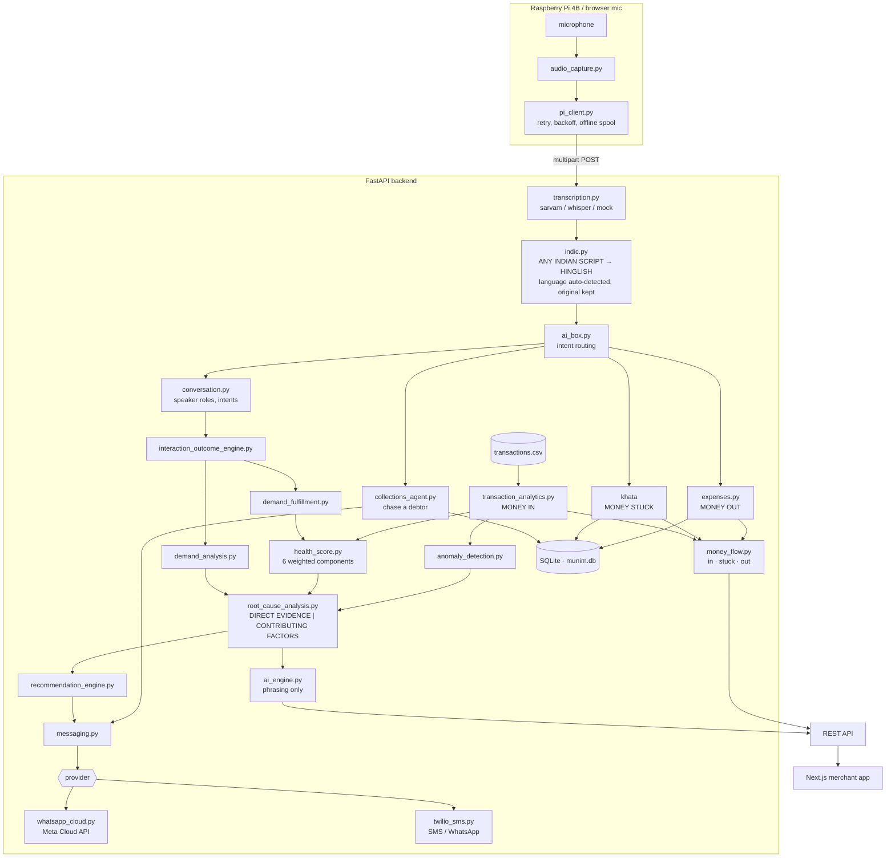

# Munim AI

> **The soundbox that runs the whole dukaan.**
>
> Paytm's AI Soundbox answers questions about digital payments.
> Munim AI runs the entire shop and takes action.
>
> Money in . money stuck . money out . money grow, plus your store's health score, insights
> and actionable suggestions, all from one voice command.

A *munim* is the bookkeeper who has sat in the corner of Indian shops for two
hundred years. He knows what came in, what went out, who still owes, and what
is running low. This is that, as a box on the counter.

---

## The problem

A payments dashboard can tell Raj his evening revenue fell 29% last week.

It cannot tell him **why**, because the reason never touched his payment
system. Fourteen customers asked for Maggi. Twelve were told it had run out
and walked away. Not one produced a transaction, a decline, or a single row of
data anywhere in Paytm.

And it cannot tell him where his **cash** went, because a shop's books are not
one column:

| | A payments app sees | A munim sees |
|---|---|---|
| **Money in** | ✅ every UPI collection | ✅ |
| **Money stuck** | ❌ udhaar is a diary under the counter | ✅ |
| **Money out** | ❌ the wholesaler was paid in cash | ✅ |

**A sale that does not happen leaves no record. Neither does cash.** Closing
both blind spots is what this product does.

---

## The three columns

```
   MONEY IN              MONEY STUCK             MONEY OUT
   ₹32,753               ₹1,050                  ₹6,500
   107 sales today       2 customers owe you     stock & supplier
   ────────────────      ────────────────        ────────────────
   Paytm transactions    Smart Khata  🎙         Spoken book  🎙
```

Only the first column exists in payments data. The other two exist **because
the merchant said them out loud**, which is why the interface is a microphone
and not a form. In the app those two carry a `heard` badge — the design states
the argument rather than leaving it to a tagline.

Then one plain sentence, computed deterministically and never by a model:

> You are up ₹26,253 today, most of your spending is stock & supplier
> (₹5,000), and ₹1,050 is still stuck in udhaar.

---

## One voice command

Everything below is a single sentence spoken at the counter. Hinglish and
Devanagari both work: speech recognition set to `hi-IN` returns Devanagari, so
a normalisation layer maps a closed vocabulary of the words this product
actually branches on.

| Say this | Munim does |
|---|---|
| `supplier ko 5000 diye` | Books ₹5,000 under **stock & supplier** |
| `सप्लायर को 5000 रुपये दिए` | Same — Devanagari is normalised for matching |
| `bijli ka bill 1200 bhar diya` | Books ₹1,200 under **bills & utilities** |
| `Sagar ke khate mein 200 baaki hain` | Adds ₹200 to Sagar's udhaar |
| `Sujit ne 500 rupaye jama kiye` | Settles ₹500 against Sujit's balance |
| `Sagar ko yaad dilao` | **WhatsApps Sagar** what he owes, in his language |
| `Maggi khatam ho gaya` | Records unmet demand on the shop floor |
| `aaj 500 rupaye diye` | Too vague — **asks** instead of guessing |

That last row is the important one. Below a confidence threshold nothing is
written and the merchant is asked, because a spend booked wrong is invisible
until the month does not add up.

---

## Collections: chasing money that is stuck

The only part of the product that acts towards someone outside the shop, and
therefore the most tightly bounded.

```
"Kumar ko yaad dilao"
        │
        ▼
  balance from the khata  ─── never invented
  language from the customer record
  message composed deterministically
        │
        ▼
  Hi Kumar,
  Raj's Tea & Snacks se: aapka ₹500 baaki hai.
  Kripya payment kar dijiye.
  Pay Now: <link>
```

Six languages ship — Hinglish, हिन्दी, English, తెలుగు, मराठी, ગુજરાતી — and
adding one is adding one row. Four rules are enforced in code:

- **Never chase a settled account.** A zero balance means no message, ever.
- **Never chase twice in a day.** A shop that nags loses the customer.
- **Never invent an amount.** It comes from the khata, and the exact text sent
  is stored so the merchant can show it later.
- **Never invent a payment link.** With `PAYMENT_LINK_BASE` unset the line is
  omitted, because a dead link in a payment request reads as a scam.

The API separates three outcomes a merchant must be able to tell apart:
**409** should not send (settled, cooldown, no number) · **502** tried and the
channel failed · **201** sent.

---

## Architecture



**The score is never generated by a model.** Analytics, scoring, speaker
roles, outcomes, confidence, and every rupee in the three columns are pure
functions of the data. The AI layer only ever *explains* numbers already
computed.

---

## Storage

State lives in **SQLite** (`backend/data/munim.db`), not JSON files, because
two things became true at once: concurrent writers (the Pi, the browser, and
merchant actions all write), and money.

The JSON stores used read-modify-write under a process-local lock, which is no
lock at all across two workers. Measured, not assumed:

```
20 concurrent ₹10 repayments against ₹500
  before: balance 480   ← 18 payments silently lost
  after:  balance 300   ← correct
```

The fix is a `BEGIN IMMEDIATE` transaction holding the write lock across the
whole read-modify-write, not merely moving the file to a database. Existing
JSON stores are imported once on first run and left on disk untouched, so an
upgrade loses nothing and a bad import is undone by deleting `munim.db`.

---

## Setup

Two terminals. No API keys, no microphone, no Raspberry Pi required.

### Backend

```bash
cd backend
python -m venv .venv

# Windows
.venv\Scripts\activate
# macOS / Linux
source .venv/bin/activate

pip install -r requirements.txt
python data/generate_data.py          # writes transactions.csv + meta.json
uvicorn app.main:app --reload --port 8000
```

API on **http://127.0.0.1:8000**, docs at **/docs**. The database is created
on first request; there is no migration step to run.

> `--reload` watches only `backend/`, so edits to `.env` at the repo root need
> a manual restart.

### Frontend

```bash
cd frontend
npm install
npm run dev
```

App on **http://localhost:3000**. The mic uses the Web Speech API, so it works
in Chrome and Edge and degrades to typing everywhere else — the same endpoint
serves both.

### Verify

```bash
python scripts/smoke_test.py          # end-to-end checks
python scripts/test_whatsapp.py       # is the alert channel actually live?
```

---

## API

| Method | Endpoint | Returns |
|---|---|---|
| `GET` | `/api/dashboard` | Everything the home screen needs, including `money` |
| `GET` | `/api/money-flow` | Money in, stuck, out, plus the one-line verdict |
| `GET` | `/api/expenses` | The spoken expense book, with category totals |
| `POST` | `/api/expenses` | Record a spend by hand |
| `GET` | `/api/collections` | Who owes, who is chaseable, what was sent |
| `POST` | `/api/collections/remind` | Chase one customer |
| `POST` | `/api/collections/contact` | Set a customer's number and language |
| `POST` | `/api/ai-box/process` | One voice command, any intent |
| `GET` | `/api/notifications/status` | Which channel is live and what is missing |
| `POST` | `/api/notifications/test` | Prove the channel end to end |
| `GET` | `/api/health-score` | Six components, weights, comparable basis |
| `GET` | `/api/root-cause-analysis` | Direct evidence vs contributing factors |
| `GET` | `/api/insights/unified` | Insights joining both sources |
| `GET` | `/api/actions` | Restock, campaign and combined actions |
| `POST` | `/api/ai/ask` | Copilot answer plus tagged evidence |
| `POST` | `/api/shop-intelligence/text` | Transcript ingest, no hardware |
| `POST` | `/api/restock-alerts` | Create a restock alert |
| `POST` | `/api/campaigns` | Launch a campaign |
| `POST` | `/api/demo/reset` | Reset and re-seed the demo |

Full list at `/docs`.

---

## The Business Health Score

```
score = 0.21·Revenue + 0.17·Customer + 0.17·Transaction
      + 0.17·Stability + 0.13·Growth + 0.15·Demand Fulfilment
```

The five transaction components carry their original relative weights,
rescaled to make room for the sixth. **With no conversation data, the demand
weight is redistributed and the score is exactly the original five-component
score**, so weeks stay comparable and the feature cannot flatter or punish a
merchant just by existing.

| Band | Status |
|---|---|
| 80–100 | Excellent |
| 65–79 | Stable |
| 40–64 | Needs Attention |
| 0–39 | Critical |

Configurable: `DEMAND_FULFILLMENT_WEIGHT` (default 0.15, set 0 to disable).

---

## On honesty

This product makes claims about a merchant's business and sends messages to
their customers, so the line between what it *knows* and what it *suspects* is
enforced in code, not in wording:

- **Direct evidence** (ledger) and **possible contributing factors**
  (conversation) are built by different functions and returned under different
  keys. A UI cannot merge them by accident.
- Correlation confidence is **capped at 0.90**. No path emits "caused by",
  "because of" or "due to" for an inferred factor.
- **Unmet demand is never added to a money column.** It is an estimate of
  revenue that never existed; folding it into a total would turn a forecast
  into a rupee.
- **A notification is never a precondition.** Raising a restock alert and
  launching a campaign return 201 whether or not a message goes out; a channel
  failure is reported in the response body and nowhere else.
- Speaker roles are **linguistic, not biometric**. Below a confidence floor
  the answer is `unknown`.
- Transaction correlation returns **`possible_match`, never `confirmed`**.
- Every projection is labelled **Simulated / Projected**.
- The Paytm data source declares itself **mock** with
  `line_item_detail: false`.

---

## Configuration

Everything is optional. See [.env.example](.env.example).

| Variable | Default | Purpose |
|---|---|---|
| `AI_PROVIDER` | `template` | `template` · `sarvam` · `ollama` · `openai` · `anthropic` |
| `SARVAM_API_KEY` | — | Backend only. Never sent to the frontend or the Pi. |
| `SARVAM_CHAT_MODEL` | `sarvam-105b-conversations` | `sarvam-m` is deprecated and returns 400 |
| `TRANSCRIPTION_PROVIDER` | `auto` | `sarvam` · `whisper` · `mock` · `auto` |
| `MESSAGING_PROVIDER` | auto | `telegram` · `whatsapp_cloud` · `twilio` · `none` |
| `TELEGRAM_BOT_TOKEN` | — | Token from @BotFather |
| `TELEGRAM_CHAT_ID` | — | Numeric Telegram user or group chat ID |
| `TELEGRAM_BOT_MODE` | `off` | `polling` locally, or `webhook` for public HTTPS deployment |
| `TELEGRAM_BOT_VOICE_REPLIES` | `false` | Send Sarvam Bulbul spoken replies as Telegram audio |
| `SARVAM_TTS_MODEL` | `bulbul:v3` | Sarvam speech model for Telegram voice replies |
| `LENDING_BRAND_NAME` | `Sujit Shopwala Lending` | Sender name in the lending demo message |
| `LENDING_DEMO_PAYMENT_LINK` | `example.com` demo URL | Safe sample link; replace only with a verified payment URL |
| `WHATSAPP_PHONE_NUMBER_ID` | — | Meta Cloud API sender |
| `WHATSAPP_ACCESS_TOKEN` | — | Meta Cloud API token |
| `MERCHANT_ALERT_NUMBER` | — | Where merchant alerts go |
| `PAYMENT_LINK_BASE` | — | Unset ⇒ reminders carry no Pay Now link |
| `KHATA_AUTO_UPDATE_THRESHOLD` | `0.85` | Below this, ask instead of writing |
| `DEMO_MODE` | `true` | Seed a deterministic two-week shop history |
| `DEMAND_FULFILLMENT_WEIGHT` | `0.15` | Weight of the sixth component |
| `PAYTM_PROVIDER` | `mock` | `mock` · `api` (not implemented) |

**A model only ever changes phrasing.** It never computes a score, an anomaly,
a speaker role, an outcome, a rupee, or the text of a payment reminder.

### A note on messaging providers

Two are implemented behind one interface, because the choice is operational.
Twilio's **trial tier refuses free text on every channel** — WhatsApp wants a
`ContentSid`, SMS wants a predefined template name, and creating a template is
gated behind a paid plan. A payment reminder has to say a real name and a real
amount, so Meta's WhatsApp Cloud API is the default. Switching is one variable.

WhatsApp's **24-hour window** is a platform rule, not a vendor limit: free text
only reaches somebody who messaged you recently. Outside it, an approved
template is required.

---

## Project structure

```
munim-ai/
├── backend/
│   ├── app/
│   │   ├── main.py
│   │   ├── routes/           dashboard · money · collections · notifications ·
│   │   │                     health · insights · actions · shop_intelligence
│   │   └── services/
│   │       ├── db.py                           SQLite, schema, migration
│   │       ├── money_flow.py                   in · stuck · out
│   │       ├── expenses.py                     the spoken expense book
│   │       ├── collections_agent.py            chasing udhaar
│   │       ├── indic.py                        any Indian script → Hinglish
│   │       ├── hinglish.py                     thin re-export of indic.py
│   │       ├── messaging.py                    provider selection
│   │       ├── notifications.py                merchant alerts
│   │       ├── ai_box.py                       voice intent routing
│   │       ├── conversation.py                 speaker roles, intents
│   │       ├── interaction_outcome_engine.py   fulfilled / unfulfilled
│   │       ├── demand_fulfillment.py           the 6th component
│   │       ├── root_cause_analysis.py          observed vs inferred
│   │       ├── health_score.py                 6 weighted components
│   │       ├── recommendation_engine.py        3 action types
│   │       └── providers/                      sarvam · twilio · whatsapp_cloud
│   └── data/                 transactions.csv · catalog.json · munim.db
│
├── frontend/src/
│   ├── app/                  / · money · health · why · shop · actions
│   └── components/           money · voice-command · charts · ui
│
├── raspberry-pi/             pi_client · audio_capture · config
│
└── scripts/                  smoke_test.py · test_whatsapp.py
```

---

## Limitations

Stated plainly, because a demo that hides them is worth less than one that
does not:

- **No real Paytm API.** Transaction intelligence runs on a synthetic dataset;
  the provider abstraction exists so a real integration can drop in later.
- **No SKU-level matching**, so transaction correlation can only ever return
  `possible_match`.
- **Payment links are not real.** Paytm's payment-links API is not available
  here, so `PAYMENT_LINK_BASE` is yours to set and the line is omitted when it
  is not.
- **Speaker roles are linguistic**, not acoustic.
- **The shop floor is a sample**, not a census.
- **The Pi client** has been exercised in demo and check modes, not on
  physical hardware.
- **Devanagari normalisation is a closed vocabulary**, not a transliterator.
  Unmapped words pass through untouched, degrading to today's behaviour rather
  than to a wrong one.
